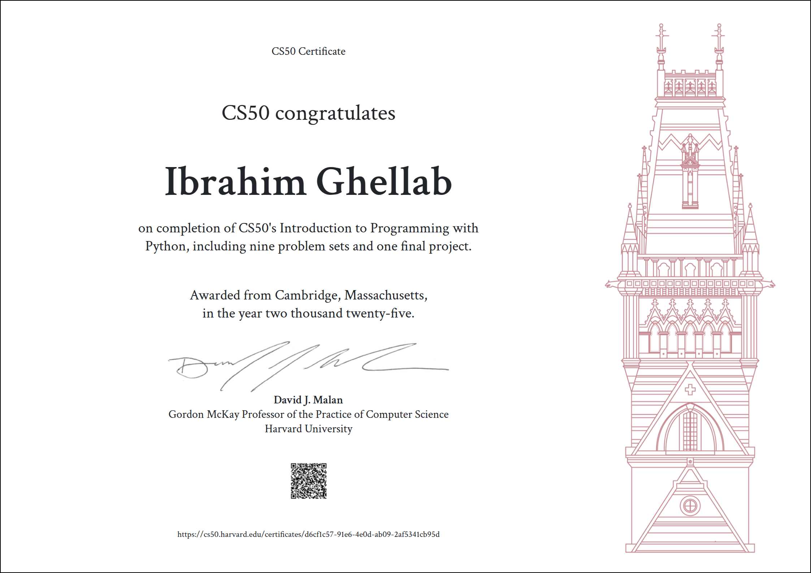

# 🎉 Completion of CS50P – Introduction to Programming with Python 🎉 

This repository marks the completion of **CS50P – Introduction to Programming with Python** from Harvard. 🏆 

## 📜 Certificate  
I successfully completed the course, and here is my official certificate:  

  

## 📚 Course Content  
This course covered the fundamental concepts of programming in Python, including:  
- Functions, Variables
- Conditionals
- Loops 
- Exceptions
- Libraries
- Unit Tests 
- File I/O
- Regular Expressions
- Object-Oriented Programming
- Et Cetera

## 🏆 Final Project  
As part of the course, I developed a final project:  
🔗 **[My CS50P Final Project](https://github.com/ibrahimghellab/CurrencyConverter)**  

---
**CS50P – Completed on [insert completion date]**  
